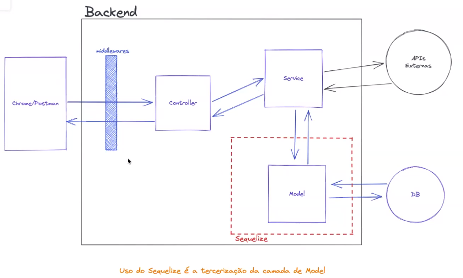
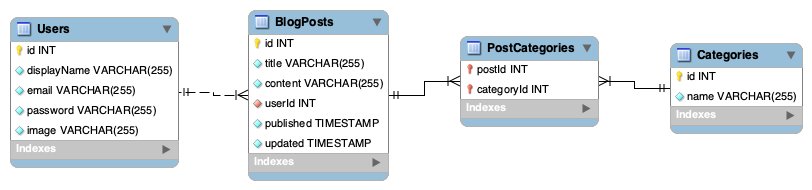

Este projeto contém os requisitos realizados por _[Anna Beatriz Garcia Trajano de Sá](www.linkedin.com/in/anna-beatriz-trajano-de-sá)_ enquanto estudava na [Trybe](https://www.betrybe.com/) :rocket:

# Project Blogs API

Neste projeto desenvolvi uma API e um banco de dados para a produção de conteúdo para um blog! Para isso utilizei o Sequelize (biblioteca de ORM para Node.js)
para fazer um CRUD de posts.


## Arquitetura de Software MSC + Sequelize

MSC + Sequelize
:-------------------------:|
  |

Banco de Dados  - Blogs API
:-------------------------:|
  |

---

## Demo


---

## Instalação do projeto localmente:
 
Após cada um dos passos, haverá um exemplo do comando a ser digitado para fazer o que está sendo pedido, caso tenha dificuldades e o exemplo não seja suficiente, não hesite em me contatar em _annagarcia@id.uff.br_ 

1. Abra o terminal e crie um diretório no local de sua preferência com o comando **mkdir**:
```javascript
  mkdir projetos
```

2. Entre no diretório que acabou de criar e depois clone o projeto:
```javascript
  cd projetos
  git clone git@github.com:annabia95/project-blogs-api.git
```

3. Acesse o diretório do projeto e depois utilize o comando **npm i** para instalar todas as dependências necessárias:
```javascript
  cd project-blogs-api
  npm i
```

- ✨ **Dica:** Caso queira utilizar _Docker_ para rodar os testes localmente e validar as funcionalidades, basta seguir as seguintes instruções:

  **:warning: Antes de começar, seu docker-compose precisa estar na versão 1.29 ou superior. [Veja aqui](https://www.digitalocean.com/community/tutorials/how-to-install-and-use-docker-compose-on-ubuntu-20-04-pt) ou [na documentação](https://docs.docker.com/compose/install/) como instalá-lo. No primeiro artigo, você pode substituir onde está com `1.26.0` por `1.29.2`.**


  > :information_source: Rode os serviços `node` e `db` com o comando `docker-compose up -d --build`.

  - Lembre-se de parar o `mysql` se estiver usando localmente na porta padrão (`3306`), ou adapte, caso queria fazer uso da aplicação em containers;

  - Esses serviços irão inicializar um container chamado `blogs_api` e outro chamado `blogs_api_db`;

  - A partir daqui você pode rodar o container `blogs_api` via CLI ou abri-lo no VS Code;

  > :information_source: Use o comando `docker exec -it blogs_api bash`.

  - Ele te dará acesso ao terminal interativo do container criado pelo compose, que está rodando em segundo plano.

  > :information_source: Instale as dependências [**Caso existam**] com `npm install`. (Instale dentro do container)
  
  - **:warning: Atenção:** Caso opte por utilizar o Docker, **TODOS** os comandos disponíveis no `package.json` (npm start, npm test, npm run dev, ...) devem ser executados **DENTRO** do container, ou seja, no terminal que aparece após a execução do comando `docker exec` citado acima. 

  - **:warning: Atenção:** O **git** dentro do container não vem configurado com suas credenciais. Ou faça os commits fora do container, ou configure as suas credenciais do git dentro do container.

  - **:warning: Atenção:** Não rode o comando npm audit fix! Ele atualiza várias dependências do projeto, e essa atualização gera conflitos com o avaliador.


## Habilidades Desenvolvidas

Neste projeto, desenvolvi as seguintes habilidades:

 - Criar endpoints que estarão conectados ao banco de dados seguindo os princípios do REST;
 - Utilizar o Sequelize para fazer um CRUD de postagens;
 
 ## Referências
 
 [Documentação Oficial - Sequelize](https://sequelize.org/docs/v6/)<br>
 [Sequelize/CLI](https://github.com/sequelize/cli)<br>
 [Performing CRUD with Sequelize](https://dev.to/nedsoft/performing-crud-with-sequelize-29cf)<br>
 [JWT](https://jwt.io/)<br>
 [Entendendo tokens JWT (Json Web Token)](https://medium.com/tableless/entendendo-tokens-jwt-json-web-token-413c6d1397f6)<br>
 [Conventional Commits](https://gist.github.com/qoomon/5dfcdf8eec66a051ecd85625518cfd13)<br>
 [Sequelize e estratégias de SQL no Node.js | Podcast FalaDev da Rocketseat](https://youtu.be/YPZehcsu9D0 )<br>

 
 ## Escopo do Projeto

## 1 - Crie migrations para as entidades Users, Categories, BlogPosts, PostCategories

## 2 - Crie o modelo 'User' em 'src/database/models/user.js' com as propriedades corretas

## 3 - Sua aplicação deve ter o endpoint POST `/login`

## 4 - Sua aplicação deve ter o endpoint POST `/user`

## 5 - Sua aplicação deve ter o endpoint GET `/user`

## 6 - Sua aplicação deve ter o endpoint GET `/user/:id`

## 7 - Crie o modelo 'Category' em 'src/database/models/category.js' com as propriedades corretas

## 8 - Sua aplicação deve ter o endpoint POST `/categories`

## 9 - Sua aplicação deve ter o endpoint GET `/categories`

## 10 - Crie o modelo 'BlogPost' em 'src/database/models/blogPost.js' com as propriedades e associações corretas

## 11 - Crie o modelo 'PostCategory' em 'src/database/models/postCategory.js' com as propriedades e associações corretas

## 13 - Sua aplicação deve ter o endpoint GET `/post`

## 14 - Sua aplicação deve ter o endpoint GET `/post/:id`
